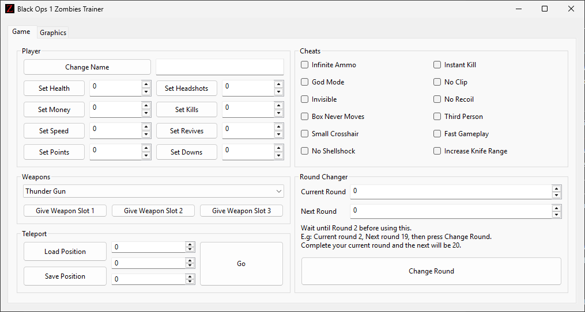

# bo1zt

**Black Ops 1 Zombies Trainer**

A simple trainer for *Black Ops 1 Zombies* written in C.
This tool is being created just for fun while learning reverse engineering fundamentals. This tool is still under development. Main features available:

Player:
- [x] Change name
- [x] Set Health
- [x] Set Points
- [x] Set Speed
- [x] Set Kills
- [x] Set Headshots

Hacks:
- [x] God Mode
- [x] No Clip
- [x] Invisible
- [x] No Recoil
- [x] Infinite Ammo
- [x] Box Never Moves
- [x] Instant Kill
- [x] Fast Gameplay
- [x] Third Person
- [x] No Shellshock
- [x] Increase Knife Rangee
- [x] Small Crosshair

Graphics:
- [x] Set FOV
- [x] Set FOV Scale
- [x] Set FPS Cap or Unlimit FPS
- [x] Make Borderless
- [x] Disable HUD
- [x] Disable FOG
- [x] Fullbright mode
- [x] Colorized mode
- [] Customize UI

Misc:
- [x] Give any weapon in any slot
- [] Give ammo
- [x] Teleport to any location. They can be saved and loaded.
- [x] Change to any round
- [] Game info
- [] TIM Compatibility

And a lot more stuff not yet scoped.

## Requirements

To build and run this project, you’ll need:

* **MinGW-32** - This is for the `g++` compiler and `make`.
* **Meson** (version **0.58.0** - I didn't test it with newer versions) — required to build the [libui]([https://github.com/libui-ng/libui-ng](https://github.com/libui-ng/libui-ng)) library.

## Build Instructions

```bash
make && make run
```

## Usage

1. Launch *Call of Duty Black Ops 1*.
2. Run `bo1zt`.
3. Use the interface to enable or disable desired features.
4. Train train train!

## Proposed UI (WIP)


