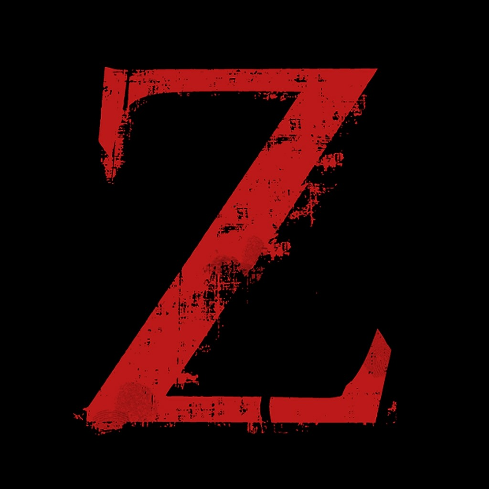

<div style="display:flex;">
  
</div>

# bo1zt

[](https://deepwiki.com/idircarlos/bo1zt)
[](https://github.com/idircarlos/bo1zt/stargazers)
[](https://github.com/idircarlos/bo1zt/network/members)
[](https://github.com/idircarlos/bo1zt/issues)
[](https://github.com/idircarlos/bo1zt/blob/main/LICENSE)
[](https://github.com/idircarlos/bo1zt/commits/main)
[](https://en.wikipedia.org/wiki/C_(programming_language))
[](https://github.com/libui-ng/libui-ng)
[](https://www.opengl.org/)
[](https://gitlab.com/iniparser/iniparser)
[](http://makeapullrequest.com)

**Black Ops 1 Zombies Trainer**

A simple trainer for *Black Ops 1 Zombies* written in C.
This tool is being created just for fun while learning reverse engineering fundamentals. This tool is still under development. Main features:

|    Player       |  Hacks                 |  Graphics                   |  Misc                                  |
| --------------- | ---------------------- | --------------------------- | -------------------------------------- |
|   Change name   |   God Mode             |   Set FOV                   |   Give any weapon in any slot          |
|   Set Health    |   No Clip              |   Set FOV Scale             |   Give ammo (*soon!*)                  |
|   Set Points    |   Invisible            |   Set FPS Cap / Unlimit FPS |   Teleport to any location (save/load) |
|   Set Speed     |   No Recoil            |   Make Borderless           |   Change to any round                  |
|   Set Kills     |   Infinite Ammo        |   Disable HUD               |   Game info                            |
|   Set Headshots |   Box Never Moves      |   Disable FOG               |   Fix Movement Speed PC Issue          |
|                 |   Instant Kill         |   Fullbright mode           |   Show FPS                             |
|                 |   Fast Gameplay        |   Colorized mode            |   TIM Compatibility                    |
|                 |   Third Person         |   Customize UI              |   Setup Camos (*soon!*)                 |
|                 |   No Shellshock        |                             |   Add Floating Widgets                 |
|                 |   Increase Knife Range |                             |   Open/Close Game                      |
|                 |   Small Crosshair      |                             |   Persisted Settings                   |

## Requirements

To build and run this project, you’ll need:

* **MinGW-32** - This is for the `g++` compiler and `make`.
* **Meson** (version **0.58.0** - I didn't test it with newer versions) - required to build the [libui]([https://github.com/libui-ng/libui-ng](https://github.com/libui-ng/libui-ng)) library.
* **CMake** (version **3.18.0** - I didn't test it with newer versions) - required to build the [iniparser]([https://github.com/libui-ng/libui-ng](https://gitlab.com/iniparser/iniparser)) library.

## Build Instructions

```bash
make -j8 && make run
```
