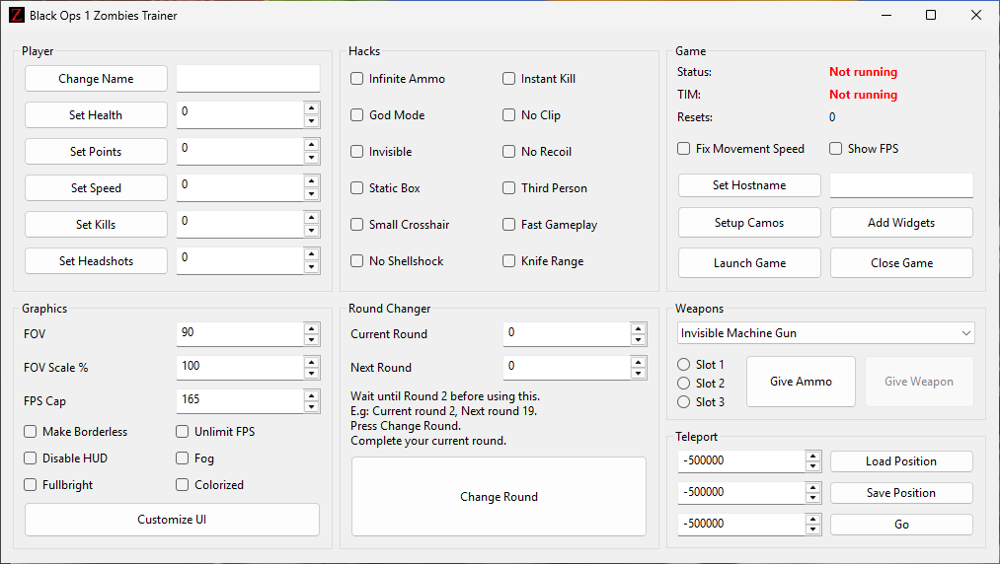

# bo1zt

**Black Ops 1 Zombies Trainer**

A simple trainer for *Black Ops 1 Zombies* written in C.
This tool is being created just for fun while learning reverse engineering fundamentals. This tool is still under development. Main features:

|    Player       |  Hacks               |  Graphics                 |  Misc                                |
| --------------- | ---------------------- | --------------------------- | -------------------------------------- |
| ✅ Change name   | ✅ God Mode             | ✅ Set FOV                   | ✅ Give any weapon in any slot          |
| ✅ Set Health    | ✅ No Clip              | ✅ Set FOV Scale             | ⬜ Give ammo                            |
| ✅ Set Points    | ✅ Invisible            | ✅ Set FPS Cap / Unlimit FPS | ✅ Teleport to any location (save/load) |
| ✅ Set Speed     | ✅ No Recoil            | ✅ Make Borderless           | ✅ Change to any round                  |
| ✅ Set Kills     | ✅ Infinite Ammo        | ✅ Disable HUD               | ⬜ Game info                            |
| ✅ Set Headshots | ✅ Box Never Moves      | ✅ Disable FOG               | ✅ Fix Movement Speed PC Issue          |
|                 | ✅ Instant Kill         | ✅ Fullbright mode           | ✅ Show FPS                             |
|                 | ✅ Fast Gameplay        | ✅ Colorized mode            | ⬜ TIM Compatibility                    |
|                 | ✅ Third Person         | ⬜ Customize UI              | ⬜ Setup Camos                          |
|                 | ✅ No Shellshock        |                             | ⬜ Add Floating Widgets                 |
|                 | ✅ Increase Knife Range |                             | ⬜ Open/Close Game                      |
|                 | ✅ Small Crosshair      |                             |                                        |

## Requirements

To build and run this project, you’ll need:

* **MinGW-32** - This is for the `g++` compiler and `make`.
* **Meson** (version **0.58.0** - I didn't test it with newer versions) — required to build the [libui]([https://github.com/libui-ng/libui-ng](https://github.com/libui-ng/libui-ng)) library.

## Build Instructions

```bash
make && make run
```

## Usage

1. Launch *Call of Duty Black Ops 1*.
2. Run `bo1zt`.
3. Use the interface to enable or disable desired features.
4. Train train train!

## Proposed UI (WIP)


